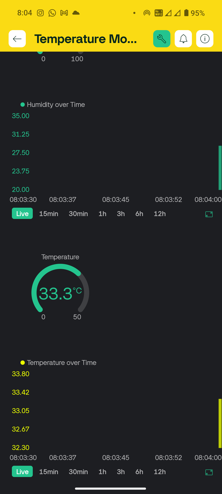

# 🌡️ Temperature & Humidity Monitoring System

<p align="center">
  <a href="#">
    
  </a>
  <a href="#">
    
  </a>
  <a href="https://blynk.io/">
    
  </a>
  <a href="#">
    
  </a>
</p>


<p align="center">
  A smart IoT project using an ESP8266 NodeMCU and a DHT11 sensor to autonomously measure and display ambient temperature and humidity in real-time. Data is shown on a local 16x2 LCD and simultaneously transmitted to the Blynk IoT platform for remote monitoring. A key feature is its ability to function independently of network connectivity, ensuring the local display works immediately on power-up.
</p>

---

## Table of Contents
- [Results & Demo](#results--demo)
- [Key Features](#key-features)
- [Technology Stack](#technology-stack)
- [Getting Started](#getting-started)
- [Future Work](#future-work)
- [Acknowledgments](#acknowledgments)
- [References](#references)
- [Contact](#contact)

---

## Results & Demo

The system successfully provides real-time environmental data to both a local LCD and a remote cloud dashboard.

* **➡️ Live Video Demo:** [Watch the project in action on YouTube!](https://youtu.be/ZVRgyXhR594)

<table>
  <tr>
    <td align="center" width="50%">
      <b>The Complete Circuit</b><br>
      <i>The ESP8266, DHT11, and LCD running on a breadboard.</i><br><br>
      <a href="https://www.youtube.com/watch?v=ZVRgyXhR594">
        
      </a>
    </td>
    <td align="center" width="50%">
      <b>Blynk Web Dashboard</b><br>
      <i>Remote monitoring dashboard showing live and historical data.</i><br><br>
      
    </td>
  </tr>
  <tr>
    <td align="center" colspan="2">
      <b>Blynk Mobile Dashboard</b><br>
      <i>Access and monitor your data on-the-go with the mobile application.</i><br><br>
      <table>
        <tr>
          <td align="center" width="50%"></td>
          <td align="center" width="50%"></td>
        </tr>
      </table>
    </td>
  </tr>
</table>
---

## Key Features

- **Real-time Monitoring:** Continuously measures and displays temperature and humidity.
- **Immediate Local Display:** Sensor readings are shown on the LCD instantly, without waiting for a Wi-Fi connection.
- **Remote Access:** Transmits sensor data to the Blynk IoT platform for monitoring via a mobile app or web dashboard.
- **Network Independent:** The system's local display operates perfectly even if the Wi-Fi connection is delayed or unavailable.
- **Efficient & Scalable:** A cost-effective and user-friendly design that can be expanded with more sensors.

---

## Technology Stack

### Hardware Components

<table>
  <tr>
    <td align="center">
      <b>ESP8266 NodeMCU</b><br><br>
      
    </td>
    <td align="center">
      <b>DHT11 Sensor</b><br><br>
      
    </td>
    <td align="center">
      <b>16x2 I2C LCD</b><br><br>
      
    </td>
  </tr>
</table>

<br>

| Category           | Technology / Component                                     |
| :----------------- | :--------------------------------------------------------- |
| **Hardware** | `ESP8266 NodeMCU`, `DHT11 Sensor (±2% RH, ±0.5°C)`, `16x2 I2C LCD` |
| **Software** | `Arduino IDE`                                              |
| **Cloud & IoT** | `Blynk IoT Platform`                                       |
| **Libraries** | `ESP8266WiFi.h`, `BlynkSimpleEsp8266.h`, `DHT.h`, `LiquidCrystal_I2C.h` |

---

## Getting Started

Follow these steps to get the project running on your own hardware.

### Prerequisites

* **Arduino IDE:** [Download here](https://www.arduino.cc/en/software)
* **ESP8266 Board Manager:** Follow [this guide](https://randomnerdtutorials.com/how-to-install-esp8266-board-in-arduino-ide/) to add ESP8266 support to your Arduino IDE.
* **Required Libraries:** Install the following libraries through the Arduino Library Manager (`Sketch` > `Include Library` > `Manage Libraries...`):
    * `Blynk` by Volodymyr Shymanskyy
    * `DHT sensor library` by Adafruit
    * `LiquidCrystal I2C` by Frank de Brabander

### Installation & Setup

1.  **Clone the Repository:**
    ```bash
    git clone https://github.com/divyanshu02raj/IoT-Temperature-Humidity-Monitor.git
    cd IoT-Temperature-Humidity-Monitor
    ```

2.  **Hardware Connections:**
    * Wire the components according to the diagram and tables below.

    

    

**DHT11 Sensor to ESP8266**

| DHT11 Pin | Function | Connection to ESP8266 |
| :--- | :--- | :--- |
| VCC | Power | 3.3V |
| GND | Ground | GND |
| Data | Data Signal | D1 (GPIO5) |

**16x2 LCD (I2C) to ESP8266**

| LCD I2C Pin | Function | Connection to ESP8266 |
| :--- | :--- | :--- |
| VCC | Power | 5V (or Vin) |
| GND | Ground | GND |
| SDA | Serial Data (I2C) | D2 (GPIO4) |
| SCL | Serial Clock (I2C) | D1 (GPIO5) |

3.  **Configure the Code:**
    * Open the `.ino` file in the Arduino IDE.
    * Find the following lines and replace the placeholders with your unique Blynk credentials and your local Wi-Fi network details:
        ```cpp
        // Paste your Blynk credentials from the Blynk Console
        #define BLYNK_TEMPLATE_ID "YOUR_TEMPLATE_ID"
        #define BLYNK_TEMPLATE_NAME "YOUR_TEMPLATE_NAME"
        #define BLYNK_AUTH_TOKEN "YOUR_AUTH_TOKEN"

        // Your WiFi credentials
        char ssid[] = "YOUR_WIFI_SSID";
        char pass[] = "YOUR_WIFI_PASSWORD";
        ```

4.  **Blynk Setup:**
    * Create a new **Template** and **Device** in your Blynk account.
    * Create two **Virtual Pin** datastreams (e.g., `V0` for Humidity, `V1` for Temperature).
    * Find your **`BLYNK_TEMPLATE_ID`**, **`BLYNK_TEMPLATE_NAME`**, and **`BLYNK_AUTH_TOKEN`** in the **Device Info** tab.

5.  **Upload to ESP8266:**
    * In the Arduino IDE, select your ESP8266 board (e.g., "NodeMCU 1.0 (ESP-12E Module)") and the correct COM port.
    * Click the "Upload" button.

---

## Future Work

-   **Automation & Control:** Integrate actuators (e.g., fans, humidifiers) to create an automated environmental control system based on sensor readings.
-   **Sensor Upgrades:** Improve accuracy by upgrading to a **DHT22** or add new parameters by including a **BMP280** (pressure) sensor.
-   **Display Upgrade:** Enhance the local display by upgrading to an **OLED or TFT screen** for better visualization and lower power consumption.
-   **Mobile Alerts:** Implement push notifications via Blynk to alert users when temperature or humidity exceeds preset thresholds.
-   **Data Logging & Analysis:** Store sensor readings in a cloud database or Google Sheets for historical tracking and trend analysis.

---

## Acknowledgments

This project was made possible by the robust open-source tools and communities behind:
* Arduino and the ESP8266 Core
* The Blynk IoT Platform
* The developers of the various libraries used

---
## References

* [ESP8266EX Datasheet](https://www.espressif.com/en/products/socs/esp8266)
* [DHT11 Sensor Datasheet](https://www.mouser.com/datasheet/2/758/DHT11-Technical-Data-Sheet-Translated-Version-1143054.pdf)
* [Blynk IoT Platform Documentation](https://docs.blynk.io/)
* [LiquidCrystal I2C Library](https://github.com/marcoschwartz/LiquidCrystal_I2C)

---

## Contact

Divyanshu Raj - [[LinkedIn](https://www.linkedin.com/in/div02raj/)] - divyanshuraj2206@gmail.com

Project Link: [https://github.com/divyanshu02raj/IoT-Temperature-Humidity-Monitor](https://github.com/divyanshu02raj/IoT-Temperature-Humidity-Monitor)